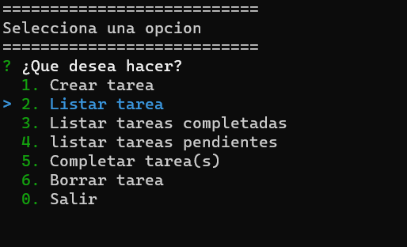
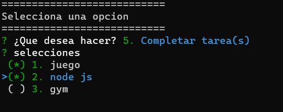

# to do list aplicacion de consola

## Acerca

"tareas por hacer" es una aplicacion para definir tareas que deseas ejecutar.

La aplicacion cuenta con un CRUD para realizar modificaciones.

Cuenta con colores para hacer la aplicacion agradable a la vista.

se utilizaron las librerias de inquirer.js y colors para darle forma a la aplicacion.

[Mas informacion acerca de inquirer.js](https://www.npmjs.com/package/inquirer)
[Mas informacion acerca de colors.js](https://www.npmjs.com/package/colors)

## Install 

To install this application you need 
(Node JS 16.0 or above)[https://nodejs.org/en/download/]

git clone //
npm install
node app.js

## Documentation 

### Menu principal

Al ejecutar la aplicacion se desplegará el menú principal, en el cual se indicaran las opciones que el usurario puede elegir.
de formar muy intuitiva el usuario puede crear, eliminar y listar tareas creadas. 

El usuario se puede desplazar por el menú con las teclas direccionales del teclado.

### Completar tareas

para actualizar el estado de las tareas se debe usar la tecla espaciadora, la aplicacion indicara con un asterisco verde al lado
derecho de la tarea objetivo.

## License 

MIT

